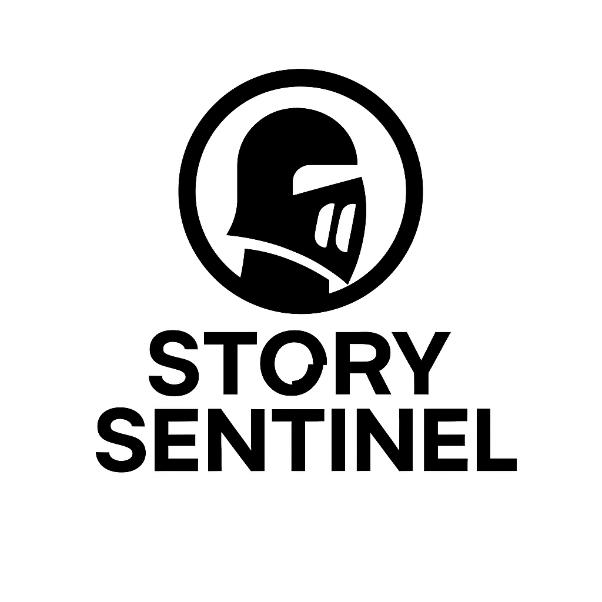
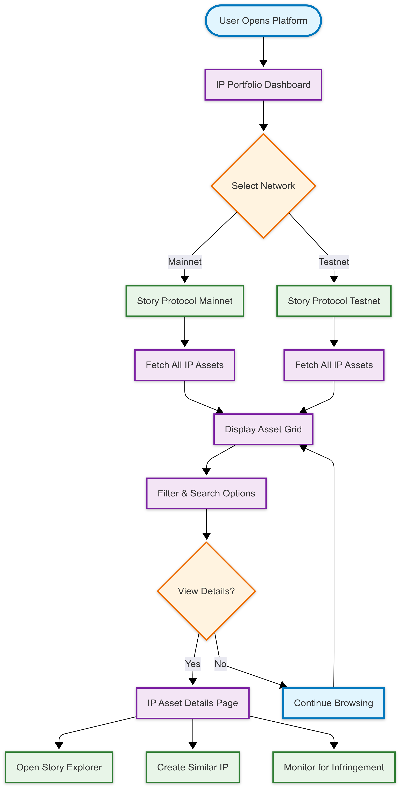
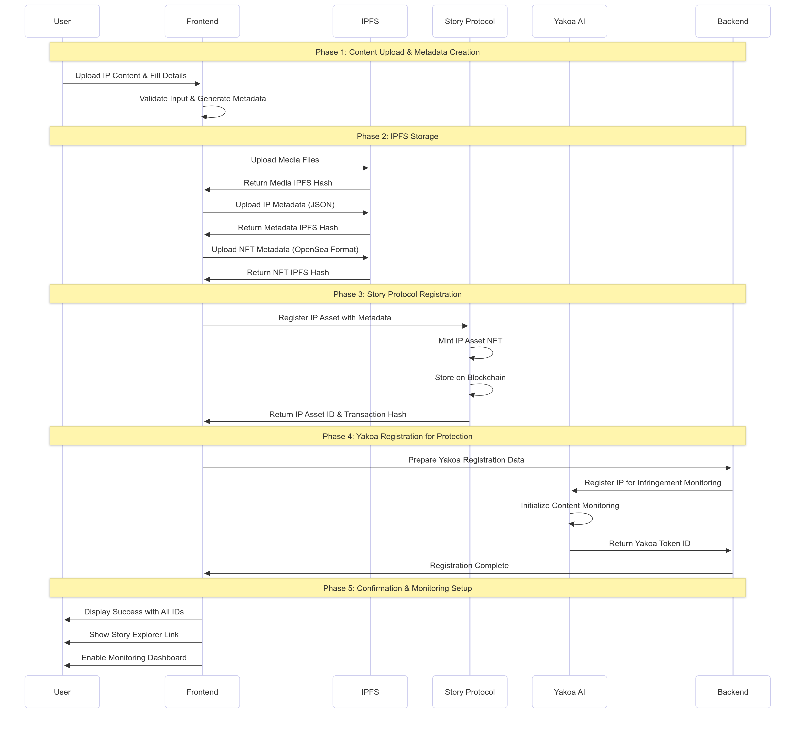
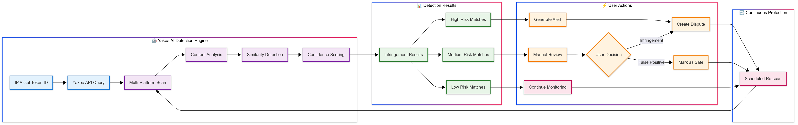
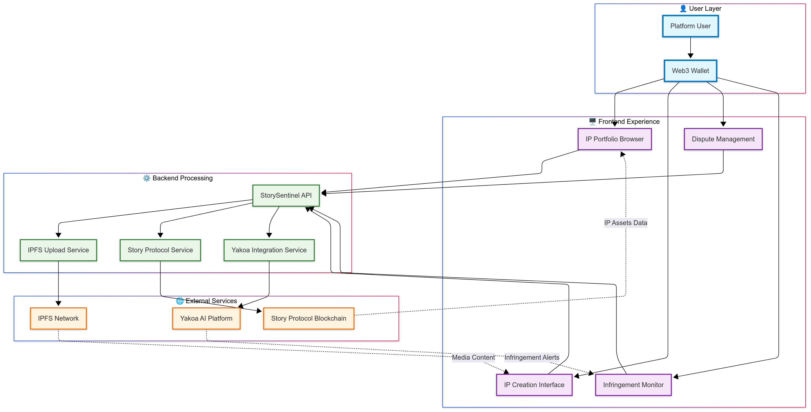

<div align="center">

# 🛡️ StorySentinel



**Next-Generation IP Protection Platform**

_Blockchain-Powered IP Registration • AI-Driven Infringement Detection • Automated Dispute Resolution_

[](https://storyprotocol.xyz)
[](https://yakoa.io)
[](LICENSE)
[](https://github.com)

</div>

---

## 🌟 Overview

StorySentinel revolutionizes intellectual property protection by seamlessly integrating blockchain technology with artificial intelligence. Our platform empowers creators, businesses, and IP holders with a comprehensive suite of tools for registering, monitoring, and enforcing intellectual property rights in the digital age.

**🔥 Why StorySentinel?**

- **Blockchain-First**: Immutable IP registration on Story Protocol
- **AI-Powered**: Advanced infringement detection via Yakoa
- **Real-Time**: Continuous monitoring across platforms
- **Automated**: Streamlined dispute resolution workflow

## ✨ Core Features

<div align="center">

### 🎯 **Complete IP Protection Ecosystem**

</div>

<table>
<tr>
<td width="50%">

### 🔐 **Blockchain IP Registry**

- **📝 Multi-Format Support**  
  Register trademarks, copyrights, patents & trade secrets
- **⛓️ Story Protocol Integration**  
  Immutable blockchain registration with proof of creation
- **🏷️ NFT Representation**  
  Each IP asset minted as a unique, tradeable NFT
- **🌐 IPFS Metadata**  
  Decentralized storage for tamper-proof evidence

</td>
<td width="50%">

### 🤖 **AI-Powered Monitoring**

- **👁️ Real-Time Detection**  
  24/7 monitoring across 100+ platforms
- **🧠 Smart Similarity Analysis**  
  Advanced ML algorithms for content comparison
- **⚡ Instant Alerts**  
  Immediate notifications for potential infringements
- **📊 Confidence Scoring**  
  AI-driven similarity ratings and match quality

</td>
</tr>
<tr>
<td>

### ⚖️ **Automated Dispute Resolution**

- **📋 Evidence Collection**  
  Automated gathering and organization of proof
- **🔗 Blockchain Submission**  
  Direct integration with Story Protocol arbitration
- **📈 Case Tracking**  
  Real-time updates on dispute progress
- **💰 Settlement Management**  
  Automated execution of resolution terms

</td>
<td>

### 📊 **Analytics & Intelligence**

- **📈 Portfolio Dashboard**  
  Comprehensive IP asset management
- **🔍 Market Intelligence**  
  Competitive analysis and trend identification
- **💹 Financial Metrics**  
  ROI tracking and cost-benefit analysis
- **📋 Compliance Reports**  
  Automated legal documentation

</td>
</tr>
</table>

---

### 🚀 **Key Differentiators**

<div align="center">

| 🏆 **Feature**          | 🏢 **Traditional IP**   | 🛡️ **StorySentinel**         |
| ----------------------- | ----------------------- | ---------------------------- |
| **Registration Speed**  | Days to Weeks           | Minutes                      |
| **Proof of Ownership**  | Paper Documents         | Blockchain Immutable         |
| **Monitoring Coverage** | Manual Checks           | AI-Powered 24/7              |
| **Dispute Resolution**  | Expensive Legal Process | Automated Blockchain         |
| **Global Reach**        | Jurisdiction Limited    | Borderless Protection        |
| **Cost Efficiency**     | High Legal Fees         | Fraction of Traditional Cost |

</div>

---

## 🚀 Platform Functionality & User Workflows

<div align="center">

### 📱 **Complete User Journey Overview**

_From Discovery to Protection - Everything You Need in One Platform_

</div>

### 🔍 **1. IP Asset Discovery & Portfolio Management**

#### **Browse All IP Assets on Story Protocol**

<div align="center">


</div>

**Key Features:**

- 🌐 **Multi-Network Support**: View IP assets from both Story Protocol Mainnet and Testnet
- 🔍 **Advanced Filtering**: Filter by type, status, creation date, and license terms
- 📊 **Real-time Data**: Live updates from Story Protocol blockchain
- 🔗 **Direct Integration**: One-click access to Story Protocol Explorer
- 📈 **Portfolio Analytics**: Track your IP asset performance and value

---

### 🏗️ **2. IP Asset Creation & Registration Workflow**

#### **Complete IP Registration Journey**

<div align="center">



</div>

**Step-by-Step Process:**

<table>
<tr>
<td width="50%">

#### **📋 Input Requirements**

- **📄 Basic Information**
  - Title and description
  - IP type (image, video, audio, document)
  - Creation date and location
- **👥 Creator Details**
  - Creator name and wallet address
  - Contribution percentages
  - Contact information
- **📁 Media Files**
  - Original content files
  - Supporting documentation
  - Preview images/thumbnails
- **⚖️ License Terms**
  - Commercial use permissions
  - Derivative work rules
  - Revenue sharing percentages

</td>
<td width="50%">

#### **🔄 Automated Processing**

- **🌐 IPFS Storage**
  - Media files uploaded to decentralized storage
  - Metadata stored as JSON with integrity hashes
  - NFT-compatible metadata generation
- **⛓️ Blockchain Registration**
  - IP Asset minted as NFT on Story Protocol
  - Immutable ownership records created
  - License terms encoded in smart contracts
- **🤖 AI Protection Setup**
  - Yakoa monitoring initialization
  - Content fingerprinting for detection
  - Cross-platform scanning enabled
- **📊 Portfolio Integration**
  - Asset added to user dashboard
  - Analytics tracking activated
  - Alerts system configured

</td>
</tr>
</table>

---

### ⚖️ **3. Dispute Management System**

#### **Comprehensive Dispute Resolution Workflow**

<div align="center">


</div>

**Dispute Types & Evidence Requirements:**

<div align="center">

| 🏷️ **Dispute Type**         | 📋 **Required Evidence**                                          | ⏱️ **Timeline** | 💰 **Fees** |
| --------------------------- | ----------------------------------------------------------------- | --------------- | ----------- |
| **Copyright Infringement**  | Original work proof, registration certificates, usage evidence    | 14-30 days      | 0.1 ETH     |
| **Trademark Violation**     | Trademark certificates, brand usage docs, market confusion proof  | 21-45 days      | 0.15 ETH    |
| **Patent Infringement**     | Patent documents, technical specifications, infringement analysis | 30-60 days      | 0.2 ETH     |
| **Unauthorized Derivative** | Original work, derivative comparison, license violation proof     | 14-21 days      | 0.08 ETH    |

</div>

---

### 🔍 **4. Yakoa-Powered Infringement Detection**

#### **AI-Driven IP Protection System**

<div align="center">



</div>

**Infringement Detection Features:**

<table>
<tr>
<td width="33%">

#### **🌐 Platform Coverage**

- **Social Media**
  - Instagram, TikTok, YouTube
  - Twitter, Facebook, LinkedIn
- **E-commerce**
  - Amazon, eBay, Etsy
  - Shopify stores, marketplace platforms
- **Content Platforms**
  - Medium, Substack, WordPress
  - Stock photo sites, art platforms
- **Custom Monitoring**
  - User-specified websites
  - API integration for proprietary platforms

</td>
<td width="33%">

#### **🧠 AI Analysis Capabilities**

- **Visual Similarity**
  - Image recognition and matching
  - Video frame analysis
  - Logo and trademark detection
- **Content Analysis**
  - Text similarity scoring
  - Audio fingerprinting
  - Document structure comparison
- **Context Understanding**
  - Usage context analysis
  - Commercial vs. fair use detection
  - Brand impersonation identification

</td>
<td width="33%">

#### **📊 Confidence Scoring**

- **High Confidence (90-100%)**
  - Exact or near-exact matches
  - Clear commercial infringement
  - Automatic alert generation
- **Medium Confidence (70-89%)**
  - Substantial similarity detected
  - Requires human review
  - Potential fair use considerations
- **Low Confidence (50-69%)**
  - Minor similarities found
  - Likely false positive
  - Continued monitoring only

</td>
</tr>
</table>

---

### 🔄 **Integration Flow Summary**

<div align="center">



</div>

## 🏗️ System Architecture & Design


### 🛠️ Technology Integration Deep Dive

#### 🌟 **Story Protocol Integration**

- **Primary Role**: Blockchain infrastructure for immutable IP asset storage and management
- **Key Features**:
  - **🏛️ IP Asset Storage**: All IP assets stored directly on Story blockchain
  - **🔐 Immutable Records**: Permanent, tamper-proof ownership and metadata
  - **⚖️ Dispute Resolution**: Decentralized arbitration with blockchain evidence
  - **💰 Automated Royalties**: Smart contract-based revenue distribution
  - **🔗 Cross-chain Assets**: Interoperable IP assets across networks
- **Status**: ✅ **Fully Integrated** - Production ready
- **Data Storage**: All IP assets, ownership records, and dispute data stored on blockchain

#### 🤖 **Yakoa AI Integration**

- **Primary Role**: Intelligent content monitoring and infringement detection
- **Key Features**:
  - Multi-platform content scanning (100+ platforms)
  - Advanced similarity analysis using deep learning
  - Real-time alert generation with confidence scoring
  - Adaptive learning for improved accuracy over time
- **Status**: ✅ **Fully Integrated** - Production ready

#### ⛓️ **Smart Contracts Development Status**

- **Current Phase**: 🚧 **Active Development**
- **Planned Features**:
  - Enhanced IP Asset NFTs with advanced metadata
  - Automated dispute resolution mechanisms
  - Royalty splitting and distribution contracts
  - Governance tokens for platform decisions
- **Timeline**: Q3 2025 estimated completion
- **Integration**: Will extend existing Story Protocol functionality

### 🛠️ Technology Stack Integration

| Layer               | Technology         | Purpose                     | Integration Status      |
| ------------------- | ------------------ | --------------------------- | ----------------------- |
| **Frontend**        | React + TypeScript | User Interface              | ✅ **Production Ready** |
| **Backend**         | Node.js + Express  | API & Business Logic        | ✅ **Production Ready** |
| **Blockchain**      | Story Protocol     | IP Assets & Dispute Storage | ✅ **Integrated**       |
| **AI Engine**       | Yakoa Platform     | Content Detection           | ✅ **Integrated**       |
| **Storage**         | IPFS + MongoDB     | Files + App Metadata        | ✅ **Operational**      |
| **Smart Contracts** | Solidity (Hardhat) | Custom IP Logic             | 🚧 **In Development**   |

### 🔗 Story Protocol Integration

StorySentinel leverages Story Protocol as the foundational blockchain infrastructure for:

- **📜 IP Asset Storage**: All IP assets are stored directly on the Story blockchain as immutable records
- **🔐 Ownership Verification**: Blockchain-based proof of creation and ownership
- **⚖️ Dispute Resolution**: Decentralized arbitration system with on-chain evidence
- **💰 Revenue Sharing**: Automated licensing and royalty distribution via smart contracts
- **🔗 Interoperability**: Cross-platform IP asset recognition and portability

**📊 Data Architecture:**

- **On-Chain**: IP assets, ownership records, disputes, licensing agreements
- **Off-Chain**: Application metadata, user preferences, cached data (MongoDB)
- **Decentralized**: Content files and media stored on IPFS

### 🤖 Yakoa AI Integration

Yakoa's advanced AI capabilities power our monitoring and detection systems:

- **👁️ Multi-Platform Monitoring**: Continuous scanning across social media, marketplaces, and content platforms
- **🧠 Deep Learning Analysis**: Advanced similarity detection using machine learning models
- **⚡ Real-Time Processing**: Instant infringement alerts and notifications
- **📊 Confidence Scoring**: AI-powered similarity ratings for detected matches
- **🔄 Continuous Learning**: Adaptive algorithms that improve over time

### 🚧 Smart Contracts Development

Our custom smart contracts (currently in development) will provide:

- **🏷️ IP Asset NFTs**: Enhanced ERC-721 tokens representing IP assets
- **🔐 Access Control**: Role-based permissions for IP management
- **💎 Revenue Distribution**: Automated royalty and licensing payments
- **🔄 Upgradeability**: Proxy pattern for contract evolution
- **⚖️ Governance**: Community-driven platform decisions

## 🚀 Quick Start Guide

<div align="center">

### 🛠️ **Get StorySentinel Running in 5 Minutes**

</div>

### 📋 Prerequisites

<table>
<tr>
<td width="25%"><strong>🟢 Node.js</strong></td>
<td width="25%"><strong>📦 Package Manager</strong></td>
<td width="25%"><strong>🗄️ Database</strong></td>
<td width="25%"><strong>🔧 Development Tools</strong></td>
</tr>
<tr>
<td>v18.0+ Required</td>
<td>npm or yarn</td>
<td>MongoDB (local/cloud)</td>
<td>Git, VS Code</td>
</tr>
</table>

### ⚡ One-Command Setup

```bash
# Clone and setup everything
git clone https://github.com/your-org/StorySentinel.git
cd StorySentinel
npm run setup:all
```

### 🔧 Manual Installation

<details>
<summary><strong>📁 1. Clone Repository</strong></summary>

```bash
git clone https://github.com/your-org/storysentinel.git
cd storysentinel
```

</details>

<details>
<summary><strong>📦 2. Install Dependencies</strong></summary>

```bash
# Install all workspace dependencies
npm install

# Or install individually
cd frontend && npm install
cd ../backend && npm install
cd ../contracts && npm install
```

</details>

<details>
<summary><strong>⚙️ 3. Environment Configuration</strong></summary>

```bash
# Copy environment templates
cp backend/.env.example backend/.env
cp frontend/.env.example frontend/.env

# Configure your API keys
nano frontend/.env  # Add your API keys
nano backend/.env   # Add your credentials
```

**Required Environment Variables:**

```env
# Frontend (.env)
VITE_THIRDWEB_CLIENT_ID=your_thirdweb_client_id
VITE_STORY_API_KEY=your_story_protocol_key
VITE_YAKOA_API_KEY=your_yakoa_api_key

# Backend (.env)
MONGODB_URI=mongodb://localhost:27017/storysentinel
STORY_API_KEY=your_story_protocol_key
YAKOA_API_KEY=your_yakoa_api_key
JWT_SECRET=your_jwt_secret
```

</details>

<details>
<summary><strong>🚀 4. Launch Development Environment</strong></summary>

```bash
# Start all services concurrently
npm run dev

# Or start individually
npm run dev:backend
npm run dev:frontend
```

</details>

### 🌐 Access Your Application

<div align="center">

| Service         | URL                                     | Status           |
| --------------- | --------------------------------------- | ---------------- |
| **🖥️ Frontend** | [localhost:5173](http://localhost:5173) | User Interface   |
| **🔌 API**      | [localhost:5000](http://localhost:3000) | Backend Services |

</div>

### ✅ Verify Installation

```bash
# Health check all services
npm run health:check

# Expected output:
# ✅ Frontend: Running on port 3000
# ✅ Backend: Running on port 5000
# ✅ Database: Connected to MongoDB
# ✅ Story Protocol: API Connected
# ✅ Yakoa: AI Service Connected
```

### 🔒 Security Setup

1. **Generate JWT Secret**: `openssl rand -hex 32`
2. **Setup MongoDB Auth**: Enable authentication in production
3. **Configure CORS**: Whitelist your domain in backend config
4. **Environment Security**: Never commit `.env` files

### 🐛 Troubleshooting

<details>
<summary><strong>Common Issues & Solutions</strong></summary>

**Port Already in Use:**

```bash
# Kill processes on ports
npx kill-port 3000 5000 8545
```

**MongoDB Connection Error:**

```bash
# Start MongoDB service
sudo systemctl start mongod  # Linux
brew services start mongodb  # macOS
```

**API Key Issues:**

- Verify your Story Protocol API key at [Story Developer Portal](https://story.foundation)
- Check Yakoa API access at [Yakoa Dashboard](https://yakoa.io)

</details>

## 📖 API Documentation

### Core Endpoints

#### IP Assets

- `GET /api/ip-assets` - List all IP assets
- `POST /api/ip-assets` - Create new IP asset
- `GET /api/ip-assets/:id` - Get specific IP asset
- `PUT /api/ip-assets/:id` - Update IP asset
- `POST /api/ip-assets/:id/register` - Register on Story Protocol
- `POST /api/ip-assets/:id/scan` - Trigger infringement scan

#### Alerts

- `GET /api/alerts` - List alerts with filtering
- `POST /api/alerts` - Create new alert
- `PUT /api/alerts/:id` - Update alert status
- `POST /api/alerts/mark-read` - Mark multiple alerts as read
- `POST /api/alerts/:id/escalate` - Escalate alert to dispute

#### Disputes

- `GET /api/disputes` - List disputes
- `POST /api/disputes` - Create new dispute
- `POST /api/disputes/:id/submit-story` - Submit to Story Protocol
- `POST /api/disputes/:id/evidence` - Add evidence

#### Analytics

- `GET /api/analytics/overview` - Dashboard overview
- `GET /api/analytics/assets` - Asset statistics
- `GET /api/analytics/alerts` - Alert analytics
- `GET /api/analytics/disputes` - Dispute metrics
- `GET /api/analytics/financial` - Financial analysis

### External Integrations

#### Yakoa Integration

- `POST /api/yakoa/search` - Search for content
- `POST /api/yakoa/analyze` - Analyze content for infringement
- `GET /api/yakoa/monitoring/:assetId` - Get monitoring status
- `POST /api/yakoa/monitoring/start` - Start monitoring
- `POST /api/yakoa/monitoring/stop` - Stop monitoring

#### Story Protocol Integration

- `POST /api/story/register` - Register IP on blockchain
- `GET /api/story/asset/:ipId` - Get blockchain asset details
- `POST /api/story/license/create` - Create license
- `POST /api/story/dispute/submit` - Submit dispute
- `GET /api/story/royalties/:ipId` - Get royalty information

## 🤝 Contributing to StorySentinel

<div align="center">

**🎯 We Welcome All Contributors!**

[](CONTRIBUTING.md)
[](https://github.com/your-org/StorySentinel/pulls)
[](https://github.com/your-org/StorySentinel/issues)

</div>

### 🛠️ Development Workflow

1. **🍴 Fork** the repository
2. **🌟 Create** a feature branch: `git checkout -b feature/amazing-feature`
3. **✨ Implement** your changes with tests
4. **📝 Commit** with conventional commits: `git commit -m 'feat: add amazing feature'`
5. **🚀 Push** to branch: `git push origin feature/amazing-feature`
6. **📬 Open** a Pull Request with detailed description

### 🎯 Contribution Areas

- 🐛 **Bug Fixes**: Help us squash bugs and improve stability
- ✨ **New Features**: Implement exciting new functionality
- 📚 **Documentation**: Improve guides, tutorials, and API docs
- 🎨 **UI/UX**: Enhance user interface and experience
- 🔧 **DevOps**: Improve CI/CD, deployment, and infrastructure
- 🧪 **Testing**: Increase test coverage and quality

---

## 🏆 Acknowledgments & Credits

<div align="center">

### 🤝 **Powered by Industry Leaders**

</div>

<table>
<tr>
<td align="center" width="25%">

<strong>Story Protocol</strong><br/>
<small>Blockchain IP Infrastructure</small>

</td>
<td align="center" width="25%">
<strong>Yakoa AI</strong><br/>
<small>Content Detection Engine</small>
</td>
<td align="center" width="25%">
<strong>Thirdweb</strong><br/>
<small>Web3 Development</small>
</td>
</tr>
</table>

### 🙏 Special Thanks

- **Story Protocol Team** for pioneering blockchain IP infrastructure
- **Yakoa AI Team** for advanced AI-powered content detection

---

<div align="center">

## 📄 License

This project is licensed under the **MIT License** - see the [LICENSE](LICENSE) file for details.

---

### 🚀 **Ready to Protect Your IP?**

<a href="https://storysentinel.com" target="_blank">

</a>

**Built with ❤️ for creators, innovators, and visionaries worldwide**

---

<sub>© 2025 StorySentinel. Empowering creators through blockchain and AI.</sub>

</div>
